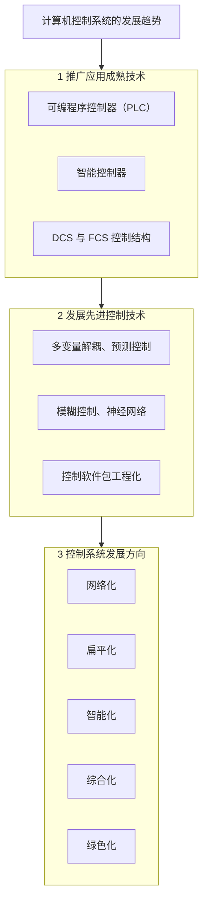

## 有疑问的错题


## 错题回顾


这里要写8EH


## 1.概述

### 1.1 计算机系统的一般概念

_计算机系统控制框图_
1. 计算机控制系统的工作过程
   - 实时数据采集——对被控参数的瞬时值进行检测、转换并输入计算机中；
   - 实时决策一对采集到的表征被控参数的状态变量进行分析,并按已给的控制规律进行计算,决定进一步的控制策略;
   - 实时控制——根据决策的结果,适时地对控制机构发出控制信号。
2. 计算机控制系统采样周期$T_s$的确定
   - 被控过程出现的事件能够保持多长的时间
   - 该事件要求计算机在多长的时间内做出反应
3. 实时性指标（参考计算机控制系统框图，能造成延时的都在通道上）
   - 检测仪表廷时
   - 过程输入(A/D)延时
   - 计算机运算延时
   - 数据传输(D/A)廷时等

### 1.2 计算机系统的组成
#### 1.2.1 硬件组成

_计算机控制系统硬件组成框图_
1. 主机\\
  由微处理器、内存储器及时钟电路组成,是控制系统的核心。它根据输人通道送来的被控对象的状态参数,按照预先安排好的程序,自动进行信息处理,并作出相应的控制决策,然后以信息的形式通过输出通道发出控制命令,控制被控对象进行工作。
2. 标准外部设备\\
  输入设别、输出设备、外存储器
3. 输入输出通道
   - 输入通道：模拟量输入通道（A/D通道），开关量输入通道（DI通道）
   - 输出通道：模拟量输出通道（D/A通道），开关量输出通道（DO通道）
4. 接口\\
  协调计算机与外设和外围通道的工作。
5. 人机联系设备
6. 通信设备\\
  完成不同位置，不同功能的计算机或设别的信息交换。

#### 1.2.2 软件组成
1. 系统软件\\
  操作系统、程序设计系统、通信网络软件和诊断系统。【通用性、厂家提供】
2. 应用软件\\
  控制算法程序、输入/输出接口程序、监控程序和信息管理程序等。【具体任务和场景】

计算机控制是**实时运行**系统，设计软硬件时**充分保证**系统运行的**实时性**和**可靠性**。

### 1.3 计算机控制系统的结构形式
- 操作指导控制系统（人来指导，计算机基本只有显示输入和控制输出功能）
- 直接数字控制系统（本课程主要学习的系统）
- 监督控制系统（多台计算机，对多个控制对象进行控制，由一个主要计算机进行统筹，形成一个系统）
- 集散控制系统（分布式，通信网络连接了局部子系统，全系统协调控制）
- 现场总线控制系统（分布式，改进集散控制系统，提高了开放性和可靠性）
- 综合自动化系统（全部过程统一控制）

### 1.4 计算机控制系统的发展概况和发展趋势
#### 1.4.1 计算机控制系统的发展概况
- 计算机控制是以自动控制理论和计算机技术为基础的。
- 计算机控制理论的基本理论\\
  采样定理、经典控制理论、离散控制理论

#### 1.4.2 计算机控制系统的发展趋势


## 2.通道接口技术
### 2.1 计算机对外围通道的控制
计算机对外围通道的控制,一般说来其工作基础是中断系统,具体实施是通过**接口电路**进行的,计算机的输入/输出指令及其有关的逻辑提供了CPU使用外围通道的全部控制信号。
- 输入接口至少要求：译码电路，三态缓冲器（外设的任意信息随时可以读入，除了读入时为了保证信号不冲突需要三态缓冲器） 
- 输出接口至少要求：译码电路，数据锁存器（随时可以向外设输出，但是考虑到CPU频率更高，为了保证外设有足够的时间读入数据，所以是数据锁存器而非三态缓冲器）
  
#### 2.1.1 输入/输出指令
##### 2.1.1.1 输入/输出接口的编制方式
  - 统一编址方式（存储器映像I/O）
    - 优点：
      - 对外围的操作指令可以使用全部的存储器操作指令，速度更快更方便
      - 内存和外设的地址分布图是一个
      - I/O不受限制
    - 缺点：
      - 外设占用内存单元，使内存变少
      - 需要全字长译码
      - 程序中难以区分是否为I/O
  - 独立编制方式（隔离I/O）
    - 优点：
      - 可读性好
      - I/O指令短，执行速度快，占用内存空间少
      - I/O地址译码电路简单
    - 缺点：
      - 要有专门的IN/OUT指令，功能没有存储器指令强
  
<div style="display: flex; justify-content: center; gap: 10px; text-align: center;">
  <div>
    
    <p>存储器映像I/O</p>
  </div>
  <div>
    
    <p>隔离I/O</p>
  </div>
</div>

##### 2.1.1.2 输入/输出指令和时序


#### 2.1.2 中断
1. 计算机与外围通道传送数据的方式
   - DMA
   - 程序传送
      - 握手方式（CPU发送启动信息后，一直等着接收信息）
      - 查询方式（CPU发送启动信息后，去做其它任务，隔一段时间查询一次）
      - 中断控制方式（无论是查询方式还是中断控制方式，核心都是周期性地检测外设状态，只不过查询方式由软件主动执行检测指令，而中断方式则由硬件中断逻辑嵌入在CPU指令周期控制流程中，在每条指令执行结束后‘自动查询’是否有中断请求）【响应快、不占用CPU的时间】
2. CPU响应中断的条件（如中断控制逻辑电路图所示）
  - 要有中断申请信号
  - 中断申请信号不被屏蔽
  - cpu必须开中断
  - cpu在现行指令结束之后响应中断（指令运行的最后一个周期才采样INTR线）


_中断控制逻辑电路_

  CPU对中断的响应如下。


_CPU对中断的响应过程_

#### 2.1.3 接口
接口电路是沟通CPU与外围通道之间信息交换的桥梁。
1. 接口的目的
  - 协调CPU与独立的外部设备之间的数据传输（速度不匹配）
  - 进行数据格式的转换（数据格式不匹配）
  - 实现电气隔离、放大、消除干扰等（信号形式不匹配）
2. 并行接口构成\\
主要由控制寄存器、状态寄存器、数据输入/输出寄存器;数据总线缓冲、地址总线缓冲、地址译码；中断控制器;联络信号控制逻辑等组成。

_外围并行接口_

三种传送方式
 - 简短传送方式
 - 程序查询传送方式
 - 中断传送方式（选通输入输出）


_简单传送方式_


_程序查询传送方式_


_中断传送方式_

### 2.2 模拟量输出通道
模拟量输出通道的任务是把计算机输出的数字量信号转换成模拟电压或电流信号,去驱动 相应的执行机构,达到控制的目的。模拟量输出通道一般由接口电路、控制电路、数模转换器和电压/电流变换器等构成。模拟通道的任务为：转换——D/A、保持——离散/连续。\\
分类：
1. 输出物理信号分
   - 电压型
   - 电流型（需要外加运算放大器）
2. 输出信号极性分
   - 单极性
   - 双极性
3. 接收数字量
   - 并行方式
   - 串行方式

#### 2.2.1 D/A转换原理
R-2R梯形电阻解码网络和反向R-2R梯形电阻解码网络图如下。可见都是电流驱动的，且反向R-2R梯形电阻基准电源的负载电流与二进制数无关，可以提供转换精度。

<div style="display: flex; justify-content: center; gap: 10px; text-align: center;">
  <div>
    
    <p>R-2R梯形电阻解码网络</p>
  </div>
  <div>
    
    <p>反向R-2R梯形电阻解码网络</p>
  </div>
</div>

#### 2.2.2 D/A转换器的技术参数
1. 分辨率（$1LSB=V_{REF}/2^n$）
2. 线性误差（最大偏差处的值）
3. 微分非线性（转移特性上任意两个相邻数码所对应的模拟量间隔与理论值1LSB之间的差值，通常要求小于±1/2LSB）
4. 单调性
5. 建立时间
6. 输出电平
7. 输入编码
8. 温度系数
9. 电源抑制比
10. 工作温度范围

#### 2.2.3 集成D/A转换器
##### 2.2.3.1 DAC0832
结构框图如下，写的很清楚，注意框图中标出的引脚类型。


_DAC0832结构框图_

没什么特别好说的，两个寄存器，三种输出方式，直通、单缓冲、双缓冲，电路图如下。

<div style="display: flex; justify-content: center; gap: 10px; text-align: center;">
  <div>
    
    <p>直通</p>
  </div>
  <div>
    
    <p>单缓冲</p>
  </div>
    <div>
    
    <p>双缓冲</p>
  </div>
</div>

一个和ISA总线接口的示例，单缓冲模式输出方波，连接图和代码如下。

_DAC0832与ISA总线接口_

```
       MOV DX, 200H      ; Y0为端口地址
LOOP1: MOV AL, 00H
       OUT DX, AL        ; 向DAC0832输出全0
       CALL DELAY        ; 调用延时子程序DELAY（具体实现未给出）
       MOV AL, 0FFH
       OUT DX, AL        ; 向DAC0832输出全1
       CALL DELAY
       JMP LOOP1
```


## 5.数字控制器的连续化设计

### 5.1 连续化设计方法的条件

- 量化单位要小
- 满足香农采样定理（要求采样周期相当短）

### 5.2 连续化设计步骤

1. 设计连续控制器（校正装置D(s)）【此时可以对零阶保持器进行一阶近似或者二阶近似】

2. 将连续化控制器离散化

3. 检验闭环系统性能

   1. 脉冲响应特性
   2. 阶跃响应特性
      - 超调量
      - 振荡次数
      - 上升时间
      - 过渡时间
   3. 频率特性
      - 通频带
      - 增益裕度
      - 相位裕度
      - 闭环频率响应通频带
      - 峰值
   4. 直流增益
   5. 零极点分布

   改进设计的途径

   - 重新选择合适的离散化方法
   - 提高采样率
   - 修正D(s)的设计

4. 编程，在计算机上实现D(z)

### 5.3 D(s)的离散化方法

#### 5.3.1 脉冲响应不变法

1. 离散化公式
   $$
   \begin{equation}
      D(z) = Z[D(s)]
   \end{equation}
   $$

2. 映射关系
   $$
   \begin{equation}
      z = e^{sT_s}
   \end{equation}
   $$
   这种方法即z变换，存在重叠映射

3. 避免频率混叠现象的办法

   - 采样前串联低通滤波器，以衰减高频分量【引入滞后项，降低稳定裕度】
   - 使用最够高的采样频率

4. 特点

   - 脉冲响应在采样时刻相同
   - 若D(s)稳定则D(z)稳定
   - 由于多值映射，只适用于高频特性衰减很好的低通或带通滤波器的离散化

#### 5.3.2 阶跃响应不变法

1. 离散化公式
   
   <div style="text-align: center;">
   $$
   Z^{-1}[\frac{1}{1-z^{-1}}D(z)] = L^{-1}[\frac{1}{s}D(s)] \\
   $$
   </div>
   
$$
\begin{equation}
  \Rightarrow D(z) = (1-z^{-1})Z[\frac{1}{s}D(s)]\\=Z[\frac{1-e^{-T_ss}}{s}D(s)]
\end{equation}
$$

2. 频率响应

   相当于串接了一个低阶滤波器，使高频分量有所衰减，频率混叠现象比Z变换法有所减轻

3. 特点

   -  本质上还是z变换，若D(s)稳定，则D(z)一定稳定
   -  频率混叠现象有所减轻
   -  能保持稳态增益不变

#### 5.3.3 差分变换法

##### 关于左边拉式变换右边z变换的合理性的

实质上是**系统的同构**，由于想要用差分代替微分时，序列需要满足的差分方程是由**微分方程**推导得到的，此时每一个s都被替换成了$f(z)$，以此来满足差分等效，只是等效方式不同，就带来了不同的$f(z)$，于是有了前后向差分和双线性变换。与其用等号连接，不如用“等效”连接。
<div style="text-align: center;">
$$
\text{进行}s \text{变换} \Leftarrow \frac{de(t)}{dt} \Leftrightarrow \frac{e(k+1)-e(k)}{T_s} \Rightarrow \text{进行} z \text{变换}
$$
</div>


1. 离散化公式

   用差分等效微分，和积分中的矩形等效原理相同，实质是以矩形变换替换积分
   $$
   \frac{de(t)}{dt}|_{t=kT_s} \approx \frac{e(k+1)-e(k)} {T_s} \approx \frac{e(k)-e(k-1)}{T_s}\\
   左边拉式变化sE(s),右边z变换,得到s=f(z)时D(s)的值等于D(z)\\
   前向差分（forward）D(z)=D(s)|_{s=\frac{z-1}{T_s}}\\
   后向差分（backward）D(z) = D(s)|_{s=\frac{1-z^{-1}}{T_s}}
   $$

2. 物理意义：以矩形面积替代积分

   

3. 后向差分的映射关系
   $$
   对于s = j \omega 的s平面到z平面映射,Re[z]=\frac{\omega^2}{1+\omega^2},Im[z] = \frac{\omega}{1+\omega^2}\\为一个以正半轴上\frac{1}{2}为圆心，半径为\frac{1}{2}的圆,负半平面上的点映射为小圆内的点
   $$


   ​		

4. 前向差分的映射关系
   $$
   z = s+1,将s平面右移了,在单位圆外的极点映射后不稳定
   $$
   

#### 5.3.4 双线性变换法

1. 离散化公式及其特点

   数值积分中用用梯形替代积分，比矩形更准确
   $$
   u(t) = \int_0^t e(t)dt \\
   u(k) - u(k-1) = \frac{e(k)+e(k-1)}{2T_s} \\
   (1-z^{-1})U(z) = \frac{1+z^{-1}}{2T_s}E(z)\\
   \frac{U(z)}{E(z)}=\frac{1+z^{-1}}{2T_s(1-z^{-1})}\\
   而\frac{U(s)}{E(s)} = \frac{1}{s}  \\
   得D(z)=D(s)|_{s=2T_s\frac{1-z^{-1}}{1+z^{-1}}}
   $$

2. 映射关系

   

3. 频率变换关系
   $$
   j\omega = \frac{2}{T_s}\frac{1-e^{-j\nu T_s}}{1+e^{-j\nu T_s}}=j\frac{2}{T_s}tg\frac{\nu T_s}{2}
   $$
   可见在频率$\omega$很小时是线性变换，而$\omega \rightarrow \infty$时$\nu = \frac{\pi}{T_s}$,将高频段映射到了$\nu = \frac{\pi}{T_s}$处，产生很大畸变。采样周期越小，线性段越宽

4. $D(z)$的分子具有$(1+z^{-1})$的意义

   系统多出了零点$z=-1$，且这些零点来自于无穷远点的映射，也即3.频率变换关系中的无限远处的频率响应映射。

   **双线性变换是以高频特性的畸变来换取低频特性的等效性**。

   补充零极点特性如下：

   |   特性   |               极点               |               零点               |
   | :------: | :------------------------------: | :------------------------------: |
   |   定义   |     使传递函数趋于无穷的位置     |       使传递函数为零的位置       |
   |   决定   | 系统是否稳定、响应快慢、是否震荡 |   哪些频率被抑制、频率响应特性   |
   |   影响   |  时域行为（衰减、振荡、稳定性）  |    频域行为（增益、相位变化）    |
   | 位置意义 | 越靠近虚轴 / 单位圆边界响应越慢  |   越靠近单位圆，相位变化越剧烈   |
   |   应用   | 控制器设计（改善响应、保证稳定） | 滤波器设计（陷波、增强某些频率） |

##### 5 频率预畸变的双线性变换法

为了保证$D(s)$与$D(z)$等效效果更好，在特征频率处响应不变。本质上时通过映射关系，让连续系统和离散系统在该频率上的**相位增益**不变（一般幅值增益会变）。故分为以下三步

1. 计算频率预畸变值
   $$
   \omega^*_n =\frac{2}{T_s}tg\frac{\omega_n T_s}{2}
   $$

2. 对$D(s,\omega^*_n)$进行双线性变换

3. 调整直流增益
   $$
   D(z)|_{z=1}=D(s)|_{s=0}
   $$

#### 5.3.5 极点零点对应法

z变换对应了极点没有对应零点，而零极点位置决定了系统的性能，故采取零极点一一映射的方法，构造和$D(s)$相同零极点的$D(z)$然后保证在某一特征频率处增益不变。

关于为什么脉冲响应不变法只是极点不变，且为什么能保证极点不变，是因为脉冲响应本质上就是系统本身的“回响”，脉冲响应能对上，就说明是极点相同（$H(s)=H(z)=1$）

1. 离散化公式

   找到对应零点和极点，进行代换
   $$
   s-(\sigma+j\omega) \Leftrightarrow1-z^{-1}e^{(\sigma+j\omega)T_s}
   $$
   对于无穷远处的零点，在$z=-1$处配置。关于为什么需要配置在$z=-1$处，是为了模拟连续系统的高频截止行为。在次映射下$\pi$处已经是对应离散系统能响应的最高频率了，而连续系统能响应的最高频率为无穷远处，增益都为0，其实是在保证零点增益匹配，**模拟高频截止**。

   还需要注意的是，在连续域中的零极点格式为s的多项式，但是在离散域中一般写成$1-z_iz^{-1}$的形式，这样其实更符合映射$z=e^{sT_s}$的观察

2. 选定特定频率处增益不变，具有低通滤波性的$D(s)$一般选择直流增益不变，有s的$D(s)$则高频段增益相等。因为$z=1$时增益最大的地方，不会衰减，其它点在$t\rightarrow \infty$时会趋于0
$$
\begin{equation}
\begin{alignedat}{2}
\text{特征频率增益一致：} \quad & D(z)\bigg|_{z=e^{j\omega_0 T_s}} & = \quad & D(s)\bigg|_{s=j\omega_0} \\
\text{高通特性：} \quad & D(z)\bigg|_{z=1}               & = \quad & D(s)\bigg|_{s=\infty} \\
\text{低通特性：} \quad & D(z)\bigg|_{z=1}               & = \quad & D(s)\bigg|_{s=0}
\end{alignedat}
\end{equation}
$$

### 5.4 总结

- 双线性变换（包括预畸变）和零极点匹配法等效性能较好，尤其是才采样频率较低时比其它方法适应性更强
- 差分法和带零阶变换法在采样率较高时也可以用
- z变换只适用于离散低通滤波器，如果D(s)的高频特性不衰减，则无论采样频率多高，都无法消除混叠现象，此时z变换不能用
- 采样频率对离散化性能影响很大，频率增加，离散化后性能显著变好

## 6. 数字控制器的离散设计方法

### 6.1 解析设计方法

**解析设计法设计数字控制系统的准则**是:数字控制系统在典型的时间域输人信号的作用下 (如阶跃输人、速度输人、加速度输人等),经过有限个采样周期,输出信号的稳态误差为零,且在 尽可能少的有限个数目的采样周期,稳态误差为零。它的基本出发点是根据系统的性能指标要 求,确定出闭环脉冲传递函数的形式,然后通过代数解法,求出数字控制器的传递函数

- 广义对象的传递函数
  $$
  G(z) = Z[\frac{1-e^{-T_s s}}{s}G(s)]
  $$
  事实上由框图直接推导是缺乏数学上的理论依据的，更准确的推导应该是用状态空间推导，但是很巧妙的工程上的等效和数学上的严谨推导吻合了，本质上是物理硬件上和数学公式上的吻合

- 系统框图与传递函数

  

  个人感觉这个框图其实没必要画第二个采样开关，因为D(z)输出的本身就是离散信号，但这里直接复制教材上的图
  $$
  \begin{align}
    & Y(z)=\frac{D(z)G(z)}{1+D(z)G(z)}R(z)\\
    & 闭环传递函数\Phi (z) = \frac{D(z)G(z)}{1+D(z)G(z)}  \\
    & 闭环误差传递函数\Phi_e (z) = \frac{1}{1+D(z)G(z)} \\
    &  D(z)= \frac{\Phi(z)}{\Phi_e(z)G(z)}
  \end{align}
  $$

#### 6.1.1 最小拍系统的设计

最少拍系统,也称为最小调整时间系统或最快响应系统。它是指系统对应于典型的输入具有最快的响应速度,被控量能在最短的时间内达到设定值。换言之,偏差采样值能在最短时间内达到井保持为零。

1. 闭环脉冲传递函数的确定
   $$
   \lim\limits_{k\rightarrow \infty}e(kT_s) = \lim\limits_{z\rightarrow 1}(1-z^{-1})E(z)=\lim\limits_{z\rightarrow 1}(1-z^{-1})\Phi_e(z)R(z)
   $$
   对于典型t幂函数形式的输入，$R(z)=\frac{A(z)}{(1-z^{-1})^{q}}$，想要无差，需要设计$\Phi_e(z)=(1-z^{-1})^{p}f(z)$，为使得$z^{-1}$的阶次尽量，取$p=q$，同时最简单实现，$f(z)=1$。然后代入反求D(z)

   注意这里要求G(z)无不稳定零极点，且无纯滞后环节

2. $D(z)$的物理可实现性

   G(z)作为物理可实现系统，分母最高阶次为0，分子最高阶次为$z^{-l}(l \ge0)$，这要求$\Phi(z)$的最高阶次也要为$z^{-l}$以抵消它保证物理可实现性。

   虽然控制器可以用软件实现，但它运行在实时系统中，必须满足物理可实现性，也就是**不能依赖未来的信号**。这意味着离散控制器 $D(z)$ 中只能包含滞后项（如 $z^{-1}, z^{-2}$），不能包含前向项（如 $z, z^2$），否则在实际运行时无法实时计算控制量。因此，软件虽然能“随便写”，但控制器仍必须满足因果性才能真正实现。
   $$
   D(z)= \frac{\Phi(z)}{\Phi_e(z)G(z)}=\frac{\Phi(z)}{(1-\Phi(z))G(z)}
   $$

3. $D(z)$的物理可实现性

​	避免不稳定零极点对消，这会导致对系统的内部状态失去控制，为防止D(z)和G(z)对消不稳定零极点，需要正确选择闭环脉冲传递函数以避免D(z)的不稳定零极点和G(z)对消。


<table style="margin: auto; text-align: center;">
  <thead>
    <tr>
      <th>对消类型</th>
      <th>后果</th>
      <th>是否可接受</th>
    </tr>
  </thead>
  <tbody>
    <tr>
      <td>对消<strong>不稳定极点</strong></td>
      <td>内部不稳定，响应发散</td>
      <td>❌ 禁止</td>
    </tr>
    <tr>
      <td>对消<strong>稳定极点</strong></td>
      <td>动态隐藏但不发散，响应良好</td>
      <td>✅ 允许（小心使用）</td>
    </tr>
  </tbody>
</table>


<table style="margin: auto; text-align: center;">
  <thead>
    <tr>
      <th>类别</th>
      <th>不稳定极点</th>
      <th>不稳定零点</th>
    </tr>
  </thead>
  <tbody>
    <tr>
      <td>系统行为</td>
      <td>系统会发散（响应无限增大）</td>
      <td>系统响应初期方向“反向”或产生超调</td>
    </tr>
    <tr>
      <td>控制难点</td>
      <td>系统本身不稳定，需要控制器来稳定</td>
      <td>控制器必须绕过反向动态，设计复杂</td>
    </tr>
    <tr>
      <td>控制策略</td>
      <td>设计稳定闭环（极点配置）</td>
      <td>需避免对消，保证响应可控可观</td>
    </tr>
    <tr>
      <td>稳定性影响</td>
      <td>直接导致系统不稳定</td>
      <td>不影响闭环稳定性，但影响控制性能</td>
    </tr>
    <tr>
      <td>是否能被控制稳定</td>
      <td>可以（只要系统可控）</td>
      <td>可以（但代价较大）</td>
    </tr>
  </tbody>
</table>


​	于是待定因子法，需要包含如下因子
<table style="margin: auto; text-align: center;">
  <thead>
    <tr>
      <th>闭环特性</th>
      <th>零稳态误差</th>
      <th>物理可实现</th>
      <th>稳定性</th>
    </tr>
  </thead>
  <tbody>
    <tr>
      <td>$\Phi(z)$</td>
      <td>—</td>
      <td>$z^{-l}$</td>
      <td>$(1 - z_i z^{-1})$</td>
    </tr>
    <tr>
      <td>$1 - \Phi(z)$</td>
      <td>$(1 - z^{-1})^q$</td>
      <td>—</td>
      <td>$(1 - p_i z^{-1})$</td>
    </tr>
  </tbody>
</table>

所以只要对象是**可控、可观的**，即便它有不稳定零点，也**可以用一个稳定的控制器实现无差控制**，只是动态性能会受限。

## 附录：现代数字控制中的离散化策略理解笔记

### 我的理解部分

这个概念其实非常重要。与ChatGPT交流，收获颇丰


如何用一个离散控制器去控制自然界中的连续对象呢？比较直接的想法是，希望控制对象在采样点上和连续控制方法一致，以此产生了先连续化设计，再离散求D(z)的想法。但这样做有一个问题，需要设计一个D(Z)，满足“采样器+D(z)+ZOH”在**任意输入信号**的情况下，与D(s)的控制下在采样点的值完全相同。这样控制的效果就成了一个耦合性非常强的系统，于是连续化设计一般只能满足某种输入下的相等，而很难满足任意输入下相等，甚至在高频信号下产生很大的畸变。

另一个想法，直接离散化被控对象，现在框图上全是离散性的结构了，控制的效果变成了控制对象在采样点和输入信号值相同，解耦合性相当好，成为了数字控制器设计性能最好的方法。

与其执着于设计 D(z) 去模仿 D(s) 在连续域的作用，不如把连续对象离散为 G(z)，再为其设计 D(z)。这样控制系统结构完全在数字域中，**耦合最小、控制最清晰、性能最好**。

**数字控制的本质并不是“逼近连续”，而是“适应离散”**。真正优秀的数字控制器，应建立在离散化后的对象建模之上，而非脱离现实地试图“模仿”连续系统行为。

以下是ChatGPT与我谈话的整理。

### 一、离散控制的两大设计路径

#### ✅ 路径一：连续控制器设计 + 离散实现

- **设计流程：**  
  设计 D(s) → 使用离散化方法得到 D(z) → 与 G(s) 构成数字控制系统结构

- **控制结构：**  

  u(t) → [采样器] → D(z) → [ZOH] → G(s) → y(t)

- **主要特点：**  

  - 实质结构为“采样器 + D(z) + ZOH + G(s)”  
  - D(z) 试图逼近 D(s) 在采样点的行为  
  - 通常仅对特定输入（如阶跃）能保证输出等效  
  - ZOH 造成延迟，采样周期 Ts 越大影响越严重  
  - 控制器与对象耦合性强，设计空间小

- **改进方式：**  
  可将 ZOH 的传递函数并入 G(s)，重新设计 D(s)，部分补偿滞后，但本质上仍无法实现任意输入下的完整等效。


---

#### ✅ 路径二：被控对象离散建模 + 离散控制器设计

- **设计流程：**  
  对 G(s) 通过 ZOH 离散得到 G(z) → 针对 G(z) 设计 D(z)

- **控制结构：**  

  u[k] → D(z) → G(z) → y[k]

- **主要特点：**  

  - 形成“纯离散系统”结构  
  - G(z) 准确反映采样后对象行为  
  - 控制器 D(z) 设计空间大，调节自由度高  
  - 任意输入信号均能保持良好的等效性  
  - 易于与现代控制方法结合（如状态反馈、MPC）

---

### 二、常见离散化方法对比总结

<div style="text-align: center">
  <table cellspacing="0" cellpadding="5">
    <thead>
      <tr>
        <th>方法</th>
        <th>核心思想</th>
        <th>保证的等效行为</th>
        <th>优劣简述</th>
      </tr>
    </thead>
    <tbody>
      <tr>
        <td>脉冲响应不变法</td>
        <td>保证 δ(t) 输入时采样点相等</td>
        <td>仅脉冲输入</td>
        <td>理论基础，但效果最差</td>
      </tr>
      <tr>
        <td>阶跃响应不变法</td>
        <td>保证 u(t) 输入时采样点相等</td>
        <td>仅阶跃输入</td>
        <td>工程中较常见</td>
      </tr>
      <tr>
        <td>Tustin（双线性变换）</td>
        <td>保留频率响应的逼近</td>
        <td>中频响应逼近</td>
        <td>避免高频失真，常用于 PID</td>
      </tr>
      <tr>
        <td>零极点匹配法</td>
        <td>保持 G(s) 零极点映射</td>
        <td>模态响应相似</td>
        <td>控制对象不稳定时需谨慎</td>
      </tr>
      <tr>
        <td>状态空间离散法</td>
        <td>精确离散化 x(k+1)=Ax(k)+Bu(k)</td>
        <td>任意输入</td>
        <td>数学严谨、性能最佳</td>
      </tr>
    </tbody>
  </table>
</div>


---

### 三、核心理解与要点提升

- ✅ G(z) 并非总是 Y(z)/X(z)，需依据采样原理定义，通常由脉冲响应理想采样后 z 变换获得  
- ✅ 从 D(s) 推 D(z) 本质为逼近行为，难以精确匹配连续控制器的所有性能  
- ✅ D(z) 控制 ZOH+G(s) 系统，天然存在滞后与耦合问题  
- ✅ 从 G(s) 离散化为 G(z) 后设计 D(z)，是数字控制中最自由、最精确的思路  
- ✅ 离散控制应以差分方程或状态空间为基础，而非模仿连续系统  

---

### 四、经典结构对比图

```text
连续控制器设计路径（耦合性强）：
    _________        _______        _______
u → | 采样器 | → D(z) → ZOH → G(s) → y
    ‾‾‾‾‾‾‾‾‾        ‾‾‾‾‾‾‾        ‾‾‾‾‾‾‾

离散建模控制路径（解耦性强）：
    _______        _______
u → |  D(z)  | →  G(z)  → y
    ‾‾‾‾‾‾‾        ‾‾‾‾‾‾‾
```

### 五、关键词整理

- **ZOH 滞后：** ZOH 每周期保持输入值，造成系统时延，采样周期越大影响越严重
- **状态空间离散：** 能精确描述系统离散行为，适用于任意输入信号
- **频率畸变：** 高频信号在某些离散化方法下畸变严重，Tustin 法有较好控制
- **模仿 vs 解耦：** 连续控制器的模仿思路不如纯离散系统的解耦建模有效

